# ``paytrail_ios_sdk Guide [Draft 0.1]``

Paytrail_ios_sdk is a framework created to incapsulate the Paytrail web APIs for the iOS mobile development so that developers can easily integrate the Paytrail payment solutions without the need of creating the incapsulation of their own.

## What does the framework contain? 
**Payment APIs:**
- *Create payment* => ``createPayment(of:secret:payload:completion:)``: create a normal payment transcation
- *Get payment* => ``getPayment(of:secret:transactionId:completion:)``: retrieve an exisiting payment
- *Get grouped payment providers* => ``getGroupedPaymentProviders(of:secret:amount:groups:language:completion:)``: retrieve a set of grouped payment providers without the need of creating a payment in the first place

**Token Payment APIs:**
- *Get token* => ``getToken(of:merchantId:secret:completion:)``: retrieve the token of a payment card to be saved and used in token payment
- *Create token payment* => ``createTokenPayment(of:secret:payload:transactionType:authorizationType:completion:)``: create a token payment transaction by the retrieved card token
- *Commit a token authorization hold* => ``commitAuthorizationHold(of:secret:transactionId:payload:completion:)``: commit a onhold token authorization
- *Revert an token authorization hold* => ``revertAuthorizationHold(of:secret:transactionId:completion:)``: revert an onhold token authorization
- *Pay and add card =>* ``payAndAddCard(of:secret:payload:completion:)``: create a transaction and pay while adding the payment card at the same time

**Payment Views and Components**
- ``PaymentProvidersView``: a SwiftUI view component for showing the available ``PaymentMethodProvider`` by its representative icon, grouped by ``PaymentMethodGroup``. The view shows each provider in a grid which can be inserted into any SwiftUI view as a component. For the alternative counterpart for 'UIViewController', see ``loadPaymentProvidersUIView(with:groups:delegate:)``
- ``PaymentWebView``: a SwiftUI view for showing and taking care of a payment web view with the request and responses. For the alternative counterpart for 'UIViewController', see ``loadPaymentUIWebView(from:merchant:delegate:)``
- ``PaytrailThemes``: it takes care of the theming of ``PaymentWebView``, providing the basic themes of the view's fore- and background color customization, group header font size, and provider icon size.

## Topics

### Create Normal Payment

**Required APIs and Views**  

``createPayment(of:secret:payload:completion:)`` | ``initiatePaymentRequest(from:)`` | ``renderPaymentProviderImage(by:completion:)`` | ``PaymentProvidersView`` | ``loadPaymentProvidersUIView(with:groups:delegate:)`` | ``PaymentWebView`` | ``loadPaymentUIWebView(from:merchant:delegate:)``

**Required Data Models**  

``PaymentRequestBody`` | ``PaymentRequestResponse`` | ``PaymentMethodProvider`` | ``PaymentResult``

**APIs Sequence Diagram**  



**Code Examples**  

```
// Create a normal payment
PaytrailPaymentAPIs.createPayment(of: merchant.merchantId, secret: merchant.secret, payload: createPayload(), completion: { result in
    switch result {
    case .success(let data):
        // Save providers and groups data
        providers = data.providers ?? []
        groups = data.groups ?? []
    case .failure(let error):
        // Handle error here
    }
})
```  

```
// Create a PaymentProvidersView with providers and group data
PaymentProvidersView(themes: PaytrailThemes(viewMode: .normal(), itemSize: PaytrailThemes.ItemSize.large),providers: $providers, groups: groups, paymentRequest: Binding(get: { viewModel.currentPaymentRequest }, set: { request in
    viewModel.currentPaymentRequest = request // Bind payment URLRequest
}))
```

```
// Load PaymentWebView by the URLRequest and pass a PaymentDelegate for handling a PaymentResult
if let request = viewModel.currentPaymentRequest {
    NavigationView {
        PaymentWebView(request: request, delegate: viewModel, merchant: merchant)
            .ignoresSafeArea()
            .navigationBarTitleDisplayMode(.inline)
            .toolbar {
                ...
            }
    }
}

...

// Implement onPaymentStatusChanged(_:) from PaymentDelegate
func onPaymentStatusChanged(_ paymentResult: PaymentResult) {
    // Handle PaymentResult here
}

```

### Card Tokenization, aka Add Card
**Required APIs and Views**  

``initiateCardTokenizationRequest(of:secret:redirectUrls:callbackUrls:language:) `` | ``getToken(of:merchantId:secret:completion:)`` | `` PaymentWebView``

**Required Data Models**  

``TokenizationRequestResponse`` | ``PaymentResult`` | ``PaymentDelegate`` | ``TokenizationResult``

**Card Tokenization APIs Sequence Diagram**  


**Code Examples**  

```
// 1) Initiate add card request when click on the 'Add card' button
TextButton(text: "Add card", theme: .fill()) {
    viewModel.clean()
    // 1) Initiate add card request
    viewModel.addCardRequest = PaytrailCardTokenAPIs.initiateCardTokenizationRequest(of: merchant.merchantId, secret: merchant.secret, redirectUrls: CallbackUrls(success: "https://client.com/success", cancel: "https://client.com/failure"))
}
```

```
// 2) Implement onCardTokenizedIdReceived(_:) from PaymentDelegate
func onCardTokenizedIdReceived(_ tokenizationResult: TokenizationResult) {
    guard tokenizationResult.error == nil, tokenizationResult.status == .ok else {
        // Handle tokenization error
        return
    }
    // Save card tokenizationId
    viewModel.tokenizedId = tokenizationResult.tokenizationId
}
```

```
...
// 3) Call getToken(:::) API when there is 'tokenizedId'
.onChange(of: viewModel.tokenizedId, perform: { newValue in
    guard let newValue = newValue else { return }
    showProgressView = true
    PaytrailCardTokenAPIs.getToken(of: newValue, merchantId: merchant.merchantId, secret: merchant.secret) { result in
        showProgressView = false
        switch result {
        case .success(let tokenizedCard):
            // Save tokenizedCard to the local DB
            viewModel.addCardToDb(tokenizedCard)
        case .failure(let failure):
            // Handle getToken failure
        }
    }
})
```

### Create a Token Payment

**Required APIs and Views**  

 ``createTokenPayment(of:secret:payload:transactionType:authorizationType:completion:)`` | ``commitAuthorizationHold(of:secret:transactionId:payload:completion:)`` | ``revertAuthorizationHold(of:secret:transactionId:completion:)`` | `` PaymentWebView``

**Required Data Models**  

``PaymentRequestBody`` | ``TokenPaymentRequestResponse`` | ``TokenPaymentThreeDsReponse`` | ``PaymentDelegate`` | ``PaymentResult``

**Token Payment APIs Sequence Diagram**  


**Code Examples**  

```
...
// Create token payment for each saved card when clicked
ForEach(savedCards, id: \.self) { card in
    PaymentCardView(card: card) {
        showProgressView = true
        let payload = createPayload(from: card.token)
        let authType: PaymentAuthorizationType = .charge
        PaytrailCardTokenAPIs.createTokenPayment(of: merchant.merchantId, secret: merchant.secret, payload: payload, transactionType: .cit, authorizationType: authType) { result in
            showProgressView = false
            switch result {
            case .success(let success):
                // Handle success here
                if authType == .authorizationHold { 
                    // Handle onhold transaction 
                } else {
                    // Handle charged transaction
                }
            case .failure(let failure):
                // Handle failure here
                if let failure = failure as? PaytrailTokenError,
                   let threeDSecureUrl = failure.payload?.threeDSecureUrl,
                   let url = URL(string: threeDSecureUrl) { // Handle 3DS soft decline
                        let request = URLRequest(url: url)
                        DispatchQueue.main.async {
                            // Save 3DS URLRequest, trigger PaymentWebView
                            viewModel.threeDSecureRequest = request
                        }
                }
            }
        }
    }
}
```

```
...
// Load PaymentWebView for 3DS authentication
.fullScreenCover(isPresented: Binding(get: { viewModel.threeDSecureRequest != nil }, set: { _, _ in }), content: {
    if let request = viewModel.threeDSecureRequest {
        NavigationView {
            PaymentWebView(request: request, delegate: viewModel, merchant: merchant)
                .ignoresSafeArea()
                .navigationBarTitleDisplayMode(.inline)
                .toolbar {
                    ...
                }
        }
    }
})
```

```
// Implement onPaymentStatusChanged(_:) from PaymentDelegate
func onPaymentStatusChanged(_ paymentResult: PaymentResult) {
    self.paymentResult = paymentResult
}

...
// Handle PaymentReuslt
.onChange(of: viewModel.paymentResult, perform: { newValue in
    guard let newValue = newValue else {
        return
    }

    status = newValue.status
    // Navigate to paymentResultView
    showPaymentResultView.toggle()
})
```

```
// Button view to commit an onhold transaction/payment
Button {
    guard let transacationOnHold = viewModel.transcationOnHold else { return }
    PaytrailCardTokenAPIs.commitAuthorizationHold(of: merchant.merchantId, secret: merchant.secret, transactionId: transacationOnHold.transcationId, payload: transacationOnHold.payload) { result in
        switch result {
        case .success(let success):
            // Handle commit-on-hold success
        case .failure(let failure):
            // Handle commit-on-hold failure
        }
    }
} label: {
    Text("Commit onhold transcation")
}
```

```
// Button view to cancel an onhold transaction/payment
Button {
    guard let transacationOnHold = viewModel.transcationOnHold else { return }
    PaytrailCardTokenAPIs.revertAuthorizationHold(of: merchant.merchantId, secret: merchant.secret, transactionId: transacationOnHold.transcationId) { result in
        switch result {
        case .success(let success):
            // Handle cancel on-hold payment success
            statusString = "Reverted onhold transaction: \(success.transactionId ?? "")"
        case .failure(let failure):
            // Handle cancel on-hold payment failure
        }
    }
} label: {
    Text("Revert onhold transcation")
}
```


### Add Card and Pay

**Required APIs and Views**  

``payAndAddCard(of:secret:payload:completion:)`` | `` PaymentWebView``

**Required Data Models**  

``PaymentRequestBody`` | ``PayAndAddCardRequestResponse`` | ``PaymentResult``

**Add Card and Pay API Sequence Diagram**  


**Code Examples**  


### Miscellaneous

Toggle Logging
- ``Symbol``
- How enable Logging for debug

#### HMAC Signature
- How to get and varify HMAC Signature

#### Usage of MSDK Views in an UIViewController
- How to use the MSDK views in a VC
- Create your own Views for the MSDK
- Provide sample code

#### Known Issues
- Explain the current PaymentWebView issue if it is stil valid
- Others


## Reference
Refer to Paytrail's web API docs and other necessary ones
