# ``paytrail_ios_sdk``

**Paytrail_ios_sdk** is a framework created to incapsulate the Paytrail web APIs for the iOS mobile development so that developers can easily integrate the Paytrail payment solutions without the need of creating the incapsulation of their own.

## What does the framework contain? 
**Payment APIs**
- *Create payment* => ``createPayment(merchantId:secret:payload:completion:)``: create a normal payment transcation
- *Get payment* => ``getPayment(merchantId:secret:transactionId:completion:)``: retrieve an exisiting payment
- *Get grouped payment providers* => ``getGroupedPaymentProviders(merchantId:secret:amount:groups:language:completion:)``: retrieve a set of grouped payment providers without the need of creating a payment in the first place

**Token Payment APIs**
- *Get token* => ``getToken(tokenizedId:merchantId:secret:completion:)``: retrieve the token of a payment card to be saved and used in token payment
- *Create token payment* => ``createTokenPayment(merchantId:secret:payload:transactionType:authorizationType:completion:)``: create a token payment transaction by the retrieved card token
- *Commit a token authorization hold* => ``commitAuthorizationHold(merchantId:secret:transactionId:payload:completion:)``: commit a onhold token authorization
- *Revert an token authorization hold* => ``revertAuthorizationHold(merchantId:secret:transactionId:completion:)``: revert an onhold token authorization
- *Pay and add card =>* ``payAndAddCard(merchantId:secret:payload:completion:)``: create a transaction and pay while adding the payment card at the same time

**Payment Views and Components**
- ``PaymentProvidersView``: a SwiftUI view component for showing the available ``PaymentMethodProvider`` by its representative icon, grouped by ``PaymentMethodGroup``. The view shows each provider in a grid which can be inserted into any SwiftUI view as a component. For the alternative counterpart for 'UIViewController', see ``loadPaymentProvidersUIView(with:providers:groups:delegate:)``
- ``PaymentWebView``: a SwiftUI view for showing and taking care of a payment web view with the request and responses. For the alternative counterpart for 'UIViewController', see ``loadPaymentUIWebView(from:delegate:)``
- ``PaytrailThemes``: it takes care of the theming of ``PaymentWebView``, providing the basic themes of the view's fore- and background color customization, group header font size, and provider icon size.

## Topics

### Create Normal Payment

**Required APIs and Views**  

``createPayment(merchantId:secret:payload:completion:)`` | ``initiatePaymentRequest(from:)`` | ``PaymentProvidersView`` | ``loadPaymentProvidersUIView(with:providers:groups:delegate:)`` | ``PaymentWebView`` | ``loadPaymentUIWebView(from:delegate:)``

**Required Data Models**  

``PaymentRequestBody`` | ``PaymentRequestResponse`` | ``PaymentMethodProvider`` | ``PaymentResult``

**APIs Sequence Diagram**  



**Code Examples**  

```
// Create a normal payment
PaytrailPaymentAPIs.createPayment(payload: createPayload(), completion: { result in
    switch result {
    case .success(let data):
        // Save providers and groups data
        providers = data.providers ?? []
        groups = data.groups ?? []
    case .failure(let error):
        // Handle error here
    }
})
```  

```
// Create a PaymentProvidersView with providers and group data
PaymentProvidersView(themes: PaytrailThemes(viewMode: .normal(), itemSize: PaytrailThemes.ItemSize.large),providers: providers, groups: groups, paymentRequest: Binding(get: { viewModel.currentPaymentRequest }, set: { request in
    viewModel.currentPaymentRequest = request // Bind payment URLRequest
}))
```

```
// Load PaymentWebView by the URLRequest and pass a PaymentDelegate for handling a PaymentResult
if let request = viewModel.currentPaymentRequest {
    NavigationView {
        PaymentWebView(request: request, delegate: viewModel)
            .ignoresSafeArea()
            .navigationBarTitleDisplayMode(.inline)
            .toolbar {
                ...
            }
    }
}

...

// Implement onPaymentStatusChanged(_:) from PaymentDelegate
func onPaymentStatusChanged(_ paymentResult: PaymentResult) {
    // Handle PaymentResult here
}

```

### Card Tokenization, aka Add Card
**Required APIs and Views**  

``initiateCardTokenizationRequest(merchantId:secret:redirectUrls:callbackUrls:language:) `` | ``getToken(tokenizedId:merchantId:secret:completion:)`` | `` PaymentWebView``

**Required Data Models**  

``TokenizationRequestResponse`` | ``PaymentResult`` | ``PaymentDelegate`` | ``TokenizationResult``

**Card Tokenization APIs Sequence Diagram**  


**Code Examples**  

```
// 1) Initiate add card request when click on the 'Add card' button
TextButton(text: "Add card", theme: .fill()) {
    viewModel.clean()
    // 1) Initiate add card request
    viewModel.addCardRequest = PaytrailCardTokenAPIs.initiateCardTokenizationRequest(redirectUrls: CallbackUrls(success: "https://client.com/success", cancel: "https://client.com/failure"))
}
```

```
// 2) Implement onCardTokenizedIdReceived(_:) from PaymentDelegate
func onCardTokenizedIdReceived(_ tokenizationResult: TokenizationResult) {
    guard tokenizationResult.error == nil, tokenizationResult.status == .ok else {
        // Handle tokenization error
        return
    }
    // Save card tokenizationId
    viewModel.tokenizedId = tokenizationResult.tokenizationId
}
```

```
...
// 3) Call getToken(:::) API when there is 'tokenizedId'
.onChange(of: viewModel.tokenizedId, perform: { newValue in
    guard let newValue = newValue else { return }
    showProgressView = true
    PaytrailCardTokenAPIs.getToken(tokenizedId: newValue) { result in
        showProgressView = false
        switch result {
        case .success(let tokenizedCard):
            // Save tokenizedCard to the local DB
            viewModel.addCardToDb(tokenizedCard)
        case .failure(let failure):
            // Handle getToken failure
        }
    }
})
```

### Create a Token Payment

**Required APIs and Views**  

 ``createTokenPayment(merchantId:secret:payload:transactionType:authorizationType:completion:)`` | ``commitAuthorizationHold(merchantId:secret:transactionId:payload:completion:)`` | ``revertAuthorizationHold(merchantId:secret:transactionId:completion:)`` | `` PaymentWebView``

**Required Data Models**  

``PaymentRequestBody`` | ``TokenPaymentRequestResponse`` | ``TokenPaymentThreeDsReponse`` | ``PaymentDelegate`` | ``PaymentResult``

**Token Payment APIs Sequence Diagram**  


**Code Examples**  

```
...
// Create token payment for each saved card when clicked
ForEach(savedCards, id: \.self) { card in
    PaymentCardView(card: card) {
        showProgressView = true
        let payload = createPayload(from: card.token)
        let authType: PaymentAuthorizationType = .charge
        PaytrailCardTokenAPIs.createTokenPayment(payload: payload, transactionType: .cit, authorizationType: authType) { result in
            showProgressView = false
            switch result {
            case .success(let success):
                // Handle success here
                if authType == .authorizationHold { 
                    // Handle onhold transaction 
                } else {
                    // Handle charged transaction
                }
            case .failure(let failure):
                // Handle failure here
                switch failure.category {
                case .threeDsPaymentSoftDecline:
                    // Get 3DS redirect URL
                    if let threeDSecureUrl = (failure.payload as? TokenPaymentThreeDsReponse)?.threeDSecureUrl,
                       let url = URL(string: threeDSecureUrl) {
                        let request = URLRequest(url: url)
                        DispatchQueue.main.async {
                            // Save 3DS URLRequest, trigger PaymentWebView
                            viewModel.threeDSecureRequest = request
                        }}
                default:
                    print(failure.description)
                }
            }
        }
    }
}
```

```
...
// Load PaymentWebView for 3DS authentication
.fullScreenCover(isPresented: Binding(get: { viewModel.threeDSecureRequest != nil }, set: { _, _ in }), content: {
    if let request = viewModel.threeDSecureRequest {
        NavigationView {
            PaymentWebView(request: request, delegate: viewModel)
                .ignoresSafeArea()
                .navigationBarTitleDisplayMode(.inline)
                .toolbar {
                    ...
                }
        }
    }
})
```

```
// Implement onPaymentStatusChanged(_:) from PaymentDelegate
func onPaymentStatusChanged(_ paymentResult: PaymentResult) {
    self.paymentResult = paymentResult
}

...
// Handle PaymentReuslt
.onChange(of: viewModel.paymentResult, perform: { newValue in
    guard let newValue = newValue else {
        return
    }

    status = newValue.status
    // Navigate to paymentResultView
    showPaymentResultView.toggle()
})
```

```
// Button view to commit an onhold transaction/payment
Button {
    guard let transacationOnHold = viewModel.transcationOnHold else { return }
    PaytrailCardTokenAPIs.commitAuthorizationHold(transactionId: transacationOnHold.transcationId, payload: transacationOnHold.payload) { result in
        switch result {
        case .success(let success):
            // Handle commit-on-hold success
        case .failure(let failure):
            // Handle commit-on-hold failure
        }
    }
} label: {
    Text("Commit onhold transcation")
}
```

```
// Button view to cancel an onhold transaction/payment
Button {
    guard let transacationOnHold = viewModel.transcationOnHold else { return }
    PaytrailCardTokenAPIs.revertAuthorizationHold(transactionId: transacationOnHold.transcationId) { result in
        switch result {
        case .success(let success):
            // Handle cancel on-hold payment success
            statusString = "Reverted onhold transaction: \(success.transactionId ?? "")"
        case .failure(let failure):
            // Handle cancel on-hold payment failure
        }
    }
} label: {
    Text("Revert onhold transcation")
}
```


### Pay and Add Card

**Required APIs and Views**  

``payAndAddCard(merchantId:secret:payload:completion:)`` | `` PaymentWebView``

**Required Data Models**  

``PaymentRequestBody`` | ``PayAndAddCardRequestResponse`` | ``PaymentResult``

**Add Card and Pay API Sequence Diagram**  


**Code Examples**  

```
// Button for triggering pay and add card
Button {
    viewModel.clean()
    PaytrailCardTokenAPIs.payAndAddCard(payload: createPayload()) { result in
        switch result {
        case .success(let success):
            // Handle success here
            DispatchQueue.main.async {
                if let url = URL(string: urlString) {
                    // Create payAndAddCardRequest with redirectUrl to be loaded in the PaymentWebView
                    viewModel.payAndAddCardRequest = URLRequest(url: url)
                }
            }
        case .failure(let failure):
            // Handle failure here
        }
    }
} label: {
    Text("Pay and Add a new card")
        .bold()
}
```

```
...
// Load PaymentWebView when there is payAndAddCardRequest
if let request = viewModel.payAndAddCardRequest {
    NavigationView {
        // Treat pay and add card as normal payment
        PaymentWebView(request: request, delegate: viewModel, contentType: .normalPayment)
            .ignoresSafeArea()
            .navigationBarTitleDisplayMode(.inline)
                ...
        }
}
```

```
// Implement onPaymentStatusChanged(_:) from PaymentDelegate
func onPaymentStatusChanged(_ paymentResult: PaymentResult) {
    // Handle PaymentResult here
}
```


### Misc

#### API Authentication

**PaytrailMerchant**

 A ``PaytrailMerchant`` with ``merchantId`` and ``secret`` is required for each API call. For *shop-in-shop payment*, a shop-in-shop ``merchantId`` is also required for each purchased item, check out data model ``Item`` for more details. It is recommended to create a shared ``PaytrailMerchant`` in the beginning when app launches, ideally in the ``AppDelegate``:

```
func application(_ application: UIApplication, didFinishLaunchingWithOptions launchOptions: [UIApplication.LaunchOptionsKey : Any]? = nil) -> Bool {
    ...
    PaytrailMerchant.create(merchantId: "YOUR_MERCHANT_ID", secret: "YOUR_MERCHANT_SECRET")
    return true
}
```

 **HMAC Signature**

Each API call has a HMAC SHA256 ``signature`` field signing for autheticaiton, which is calculated from the rest of the HTTP header fields and HTTP request body. An API call will *only succeed* when the HMAC signature passes the verification on services.paytrail.com. 

A client app does not need to sign the HMAC signature manually unless they decide to integrate their own APIs communicating with services.paytrail.com. To create your own HMAC signature, check out API ``hmacSignature(secret:headers:body:)``.


#### MSDK Logging

**PTLogger**

MSDK ``PTLogger`` has three levels of logging: ``.debug``, ``.warning``, and ``.error``. By default, ``.warning`` level is set for the MSDK's logs, meaning a client app will receive all the warning and error logs. When logging level is set to ``.debug``, MSDK will log all the necessary debug infos including HTTP requests and responses, and HMAC signatures for each API call authentication. 

To toggle ``.debug`` logging, simply set ``PTLogger.globalLevel`` to ``.debug`` in a place of the client app, usually in the ``AppDelegate``: 

```
import paytrail_ios_sdk

class AppDelegate: NSObject, UIApplicationDelegate {
    func application(_ application: UIApplication, didFinishLaunchingWithOptions launchOptions: [UIApplication.LaunchOptionsKey : Any]? = nil) -> Bool {
        ...
        // Toggle MSDK debug logging
        PTLogger.globalLevel = .debug
        return true
    }
}
```

#### MSDK Views in UIViewController

**Load Payment Providers UIView**

API ``loadPaymentProvidersUIView(with:providers:groups:delegate:)`` returns a grouped providers ``UIView`` which is the exact counterpart of ``PaymentProvidersView``. To use it in an ``UIViewController``, a client app only needs to set view's ``NSLayoutConstraint``: 

```
...

paymentProvidersView = loadPaymentProvidersUIView(providers: providers, groups: groups, delegate: self)

NSLayoutConstraint.activate([
    paymentProvidersView.leftAnchor.constraint(equalTo: self.view.leftAnchor, constant: providersViewLeftConstraint),
    paymentProvidersView.rightAnchor.constraint(equalTo: self.view.rightAnchor, constant: providersViewRightConstraint),
    paymentProvidersView.topAnchor.constraint(equalTo: self.view.topAnchor, constant: providersViewTopConstraint),
    paymentProvidersView.bottomAnchor.constraint(equalTo: self.view.bottomAnchor)
])
```

**Load Payment Web View**

API ``loadPaymentUIWebView(from:delegate:)`` returns a payment web view ``UIView`` which wraps the SwiftUI view of ``PaymentProvidersView``. To use it in an ``UIViewController``, a client app only needs to set view's ``NSLayoutConstraint``:

```
...

paymentWebview = loadPaymentUIWebView(from: request, delegate: self)

// A web view by default takes the whole of its parent view
NSLayoutConstraint.activate([
    paymentWebview.bottomAnchor.constraint(equalTo: view.bottomAnchor),
    paymentWebview.topAnchor.constraint(equalTo: view.topAnchor),
    paymentWebview.leftAnchor.constraint(equalTo: view.leftAnchor),
    paymentWebview.rightAnchor.constraint(equalTo: view.rightAnchor)
])
```

#### Known Issues

**WKWebView**

*The issue has been resolved by Apple in Xcode 15.0(15A240d).*

``PaymentWebView`` is bascailly a wrapper of a ``WKWebView`` which has issue with Xcode 14 when called emitting a [Security] breach log:

```
[Security] This method should not be called on the main thread as it may lead to UI unresponsiveness.
```

This is *not MSDK's issue* but essentially a known issue (r. 94019453) of poor interaction among WKWebView, Security framework, and and Xcode feature. See: https://developer.apple.com/forums/thread/714467?answerId=734799022#734799022


**HMAC Signature verification on API HTTP responses**

Currently MSDK's *HMAC Signature verification on API HTTP responses is missing*, which however does not affect APIs' functionalities. It is only due to security reason that all the HTTP responses should be signature verified.

This will be added in the future release.

**Apple Pay**

Current MSDK *does not support* native Apple Pay feature, however, ``PaymentRequestResponse`` contains ``CustomProvider`` necessary Apple Pay parameters in case the client app needs to have their own implementation.

Apple Pay support *may come* in the future release.


## References

**Create a normal payment** | https://docs.paytrail.com/#/?id=create

**Payment card tokenization** | https://docs.paytrail.com/#/?id=adding-tokenizing-cards

**Create a token payment** | https://docs.paytrail.com/#/?id=adding-tokenizing-cards

**Pay and add card** | https://docs.paytrail.com/#/?id=pay-and-add-card

**Authentication** | https://docs.paytrail.com/#/?id=authentication

**HAMC signature online calculator** | https://dinochiesa.github.io/hmachash/index.html

**Apple pay** | https://docs.paytrail.com/#/?id=apple-pay
